# SalonSphere - Multi-Tenant Beauty Salon Management Platform

<div align="center">
  
  
  [](https://nextjs.org/)
  [](https://reactjs.org/)
  [](https://www.typescriptlang.org/)
  [](https://supabase.com/)
  [](https://tailwindcss.com/)
</div>

## 📋 Table of Contents

- [Overview](#overview)
- [Architecture](#architecture)
- [Features](#features)
- [Technology Stack](#technology-stack)
- [Getting Started](#getting-started)
- [Project Structure](#project-structure)
- [Development](#development)
- [API Documentation](#api-documentation)
- [Deployment](#deployment)
- [Security](#security)
- [Contributing](#contributing)
- [License](#license)

## 🌟 Overview

**SalonSphere** is a comprehensive, multi-tenant SaaS platform designed specifically for beauty salons in the Netherlands and Belgium. It provides an all-in-one solution for appointment management, client relationships, inventory tracking, financial administration, and marketing automation.

### Key Benefits

- 🏢 **Multi-Tenant Architecture**: Secure tenant isolation with Row Level Security (RLS)
- 🌍 **Multi-Domain Support**: Custom domains and subdomains for each salon
- 🇳🇱 **Localized for Dutch Market**: Dutch language, EUR currency, local date/time formats
- 📱 **Responsive Design**: Works seamlessly on desktop, tablet, and mobile devices
- ⚡ **Real-time Updates**: Live data synchronization across all modules
- 🔒 **Enterprise Security**: GDPR compliant with comprehensive audit logging

## 🏗️ Architecture

### System Architecture Diagram


### Module Architecture

```mermaid
graph LR
    subgraph "🌐 Client Module"
        CB[Booking Flow]
        CS[Service Selection]
        CA[Authentication]
        CD[Dashboard]
    end
    
    subgraph "👩‍💼 Staff Module"
        SC[Calendar View]
        SA[Appointments]
        SP[Client Management]
        SR[Reports]
    end
    
    subgraph "⚙️ Admin Module"
        AS[Settings]
        AT[Staff Management]
        AI[Inventory]
        AB[Billing]
        AM[Marketing]
    end
    
    CB --> CS
    CS --> CA
    CA --> CD
    
    SC --> SA
    SA --> SP
    SP --> SR
    
    AS --> AT
    AT --> AI
    AI --> AB
    AB --> AM
```



### Data Flow Diagram


## ✨ Features

### 📅 Appointment Management
- **Drag & Drop Calendar**: Interactive calendar with multiple views (day, week, month)
- **Smart Scheduling**: Automatic conflict detection and availability checking
- **Treatment Series**: Support for multi-session treatments with package deals
- **Overlap Detection**: Prevents double-booking of staff or resources
- **Business Hours Validation**: Enforces booking within operational hours
- **Real-time Updates**: Live synchronization across all connected devices

### 👥 Client Management
- **Comprehensive Profiles**: Contact info, preferences, allergies, and notes
- **Treatment History**: Complete record of all services and products
- **Status Tracking**: Active, inactive, VIP, and blacklist statuses
- **Smart Search**: Filter by name, email, phone, or status
- **Data Export**: Generate reports and export client data
- **GDPR Compliant**: Built-in privacy controls and data management

### 📦 Inventory Management
- **Stock Tracking**: Real-time inventory levels with low-stock alerts
- **Product Categories**: Organized product catalog with categories
- **Purchase Orders**: Track incoming inventory and supplier management
- **Usage History**: Detailed logs of product consumption
- **Automatic Reordering**: Set reorder points and quantities
- **Cost Analysis**: Track product costs and profit margins

### 💰 Financial Management
- **Invoice Generation**: Automatic invoice creation with customizable templates
- **Payment Processing**: Integrated Mollie payments for subscriptions
- **VAT Calculations**: Automatic tax calculations based on Dutch/Belgian rules
- **Financial Reports**: Revenue, expenses, and profit analytics
- **Commission Tracking**: Staff commission calculations and reports
- **Overhead Analysis**: Track and allocate overhead costs

### 📧 Marketing & Communication
- **Email Automation**: Automated appointment confirmations and reminders
- **Custom Templates**: Personalized email templates with merge tags
- **Campaign Management**: Create and track marketing campaigns
- **Client Segmentation**: Target specific client groups
- **SMS Integration**: Optional SMS notifications (requires configuration)
- **Review Management**: Automated review requests post-appointment

### 📊 Analytics & Reporting
- **Dashboard Metrics**: Real-time KPIs and performance indicators
- **Revenue Analytics**: Track revenue by service, staff, and time period
- **Client Analytics**: Client retention, lifetime value, and frequency
- **Staff Performance**: Individual staff metrics and productivity
- **Conversion Funnel**: Track booking to completion rates
- **Custom Reports**: Export data for custom analysis

### 🔐 Security & Compliance
- **Row Level Security**: Database-level tenant isolation
- **GDPR Compliance**: Data protection and privacy controls
- **Audit Logging**: Comprehensive activity logs
- **Role-Based Access**: Staff, admin, and owner permission levels
- **Two-Factor Authentication**: Optional 2FA for enhanced security
- **Data Encryption**: Encrypted data transmission and storage

## 🛠️ Technology Stack

### Frontend
- **Framework**: [Next.js 15.3.3](https://nextjs.org/) with App Router
- **Language**: [TypeScript 5.4.5](https://www.typescriptlang.org/)
- **UI Library**: [React 18.3.1](https://reactjs.org/)
- **Styling**: [Tailwind CSS 3.4.3](https://tailwindcss.com/) with @tailwindcss/forms
- **Icons**: [Lucide React](https://lucide.dev/)
- **Forms**: [React Hook Form](https://react-hook-form.com/) with [Zod](https://zod.dev/) validation
- **PDF Generation**: [@react-pdf/renderer](https://react-pdf.org/)

### State Management
- **Server State**: [TanStack Query v5](https://tanstack.com/query)
- **Client State**: [Jotai](https://jotai.org/)
- **Real-time**: Supabase Realtime subscriptions

### Backend
- **Database**: [Supabase](https://supabase.com/) (PostgreSQL)
- **Authentication**: Supabase Auth with JWT
- **Edge Functions**: Deno-based serverless functions
- **File Storage**: Supabase Storage

### External Integrations
- **Payments**: [Mollie](https://www.mollie.com/) for subscription billing
- **Calendar**: Google Calendar API integration
- **Email**: Resend/SendGrid (configurable)

### Development Tools
- **Testing**: [Playwright](https://playwright.dev/) for E2E tests
- **Component Development**: [Storybook](https://storybook.js.org/)
- **Linting**: ESLint with Next.js config
- **Package Manager**: npm

## 🚀 Getting Started

### Prerequisites

- Node.js 18.17 or higher
- npm 9.0 or higher
- Supabase account
- Git

### Installation

1. **Clone the repository**
```bash
git clone https://github.com/yourusername/salonsphere.git
cd salonsphere
```

2. **Install dependencies**
```bash
npm install
```

3. **Set up environment variables**
```bash
cp .env.local.example .env.local
```

Edit `.env.local` with your configuration:
```env
# Supabase Configuration
NEXT_PUBLIC_SUPABASE_URL=your_supabase_url
NEXT_PUBLIC_SUPABASE_ANON_KEY=your_supabase_anon_key
SUPABASE_SERVICE_ROLE_KEY=your_service_role_key

# Application
NEXT_PUBLIC_APP_URL=http://localhost:3000

# Mollie Payments (optional)
MOLLIE_API_KEY=your_mollie_api_key

# Email Service (optional)
RESEND_API_KEY=your_resend_api_key

# Google Calendar (optional)
GOOGLE_CLIENT_ID=your_google_client_id
GOOGLE_CLIENT_SECRET=your_google_client_secret
```

4. **Set up the database**

Run the migrations in your Supabase dashboard:
```sql
-- Execute all files in supabase/migrations/ in order
```

5. **Deploy Edge Functions**
```bash
./deploy-edge-functions.sh
```

6. **Start the development server**
```bash
npm run dev
```

Visit [http://localhost:3000](http://localhost:3000) to see the application.

### Test Credentials

For development and testing:
- **Email**: briek.seynaeve@hotmail.com
- **Password**: Dessaro5667!

## 📁 Project Structure

```
salonsphere/
├── app/                      # Next.js App Router pages
│   ├── (client)/            # Client-facing booking module
│   │   └── [domain]/        # Dynamic domain routing
│   │       ├── book/        # Booking flow
│   │       ├── services/    # Service selection
│   │       └── auth/        # Client authentication
│   ├── admin/               # Admin module
│   │   ├── settings/        # Salon configuration
│   │   ├── staff/           # Staff management
│   │   ├── subscription/    # Billing & subscriptions
│   │   └── data/            # Data management
│   ├── staff/               # Staff module
│   │   ├── dashboard/       # Staff dashboard
│   │   ├── appointments/    # Appointment management
│   │   ├── clients/         # Client management
│   │   └── agenda/          # Calendar view
│   └── api/                 # API routes
│       ├── auth/            # Authentication endpoints
│       ├── webhooks/        # Webhook handlers
│       └── subscription/    # Subscription management
├── components/              # React components
│   ├── admin/               # Admin-specific components
│   ├── staff/               # Staff-specific components
│   ├── client/              # Client-specific components
│   ├── ui/                  # Reusable UI components
│   └── providers/           # Context providers
├── lib/                     # Utilities and services
│   ├── hooks/               # Custom React hooks
│   ├── services/            # Business logic services
│   ├── supabase/            # Database client
│   └── utils/               # Helper functions
├── types/                   # TypeScript definitions
│   ├── database.ts          # Generated DB types
│   ├── booking.ts           # Booking types
│   └── notification.ts      # Notification types
├── supabase/                # Supabase configuration
│   ├── migrations/          # Database migrations
│   └── functions/           # Edge functions
├── docs/                    # Documentation
├── tests/                   # E2E tests
└── public/                  # Static assets
```

### Key Directories Explained

- **`app/`**: Next.js 15 App Router structure with layout-based routing
- **`components/`**: Organized by feature/module for better maintainability
- **`lib/services/`**: Core business logic separated from UI
- **`lib/hooks/`**: Custom hooks for data fetching and state management
- **`supabase/`**: Database migrations and serverless functions
- **`types/`**: Centralized TypeScript type definitions

## 💻 Development

### Available Scripts

```bash
# Development
npm run dev              # Start development server (port 3000)
npm run build            # Build for production
npm run start            # Start production server
npm run lint             # Run ESLint
npm run type-check       # TypeScript type checking

# Testing
npx playwright test                    # Run all E2E tests
npx playwright test --ui               # Run tests with UI
npx playwright test --debug            # Debug mode
npx playwright test --project=chromium # Browser-specific tests

# Storybook
npm run storybook        # Start Storybook (port 6006)
npm run storybook:build  # Build Storybook

# Database
supabase migration new <name>         # Create new migration
supabase db push                      # Apply migrations
supabase functions deploy <name>      # Deploy edge function
./deploy-edge-functions.sh            # Deploy all edge functions
```

### Development Guidelines

#### Code Style
- Use TypeScript for all new code
- Follow existing patterns in the codebase
- Use Dutch for user-facing strings
- Keep components small and focused
- Prefer composition over inheritance

#### Multi-Tenancy
- Always include `tenant_id` in database queries
- Never bypass Row Level Security
- Test with multiple tenants
- Validate tenant context in middleware

#### State Management
- Use React Query for server state
- Use Jotai for client-side global state
- Implement optimistic updates where appropriate
- Handle loading and error states

#### Testing
- Write E2E tests for critical user flows
- Test multi-tenant scenarios
- Validate business rules
- Check responsive design

## 📡 API Documentation

### Authentication Endpoints

```typescript
// Check authentication status
GET /api/auth/check
Response: { authenticated: boolean, user?: User }

// Google OAuth
GET /api/auth/google
GET /api/auth/google/callback
```

### Subscription Management

```typescript
// Create subscription payment
POST /api/subscription/create-payment
Body: { plan: 'pro', interval: 'monthly' }

// Check payment status
GET /api/subscription/check-payment-status
Query: { paymentId: string }

// Activate subscription
POST /api/subscription/activate-payment
Body: { paymentId: string }
```

### Webhooks

```typescript
// Mollie payment webhook
POST /api/webhooks/mollie
Headers: { 'x-mollie-signature': string }
Body: { id: string }
```

### Domain Management

```typescript
// Check domain availability
GET /api/domain/availability
Query: { domain: string }

// Verify domain ownership
POST /api/domain/verify
Body: { domain: string, verificationCode: string }
```

## 🚢 Deployment

### Vercel Deployment

1. **Connect Repository**
   - Link your GitHub repository to Vercel
   - Configure environment variables in Vercel dashboard

2. **Build Settings**
   ```json
   {
     "buildCommand": "npm run build",
     "outputDirectory": ".next",
     "installCommand": "npm install"
   }
   ```

3. **Environment Variables**
   - Add all variables from `.env.local` to Vercel
   - Set `NODE_ENV=production`

### Docker Deployment

```bash
# Build Docker image
docker build -t salonsphere .

# Run container
docker run -p 3000:3000 --env-file .env.production salonsphere
```

### Edge Functions Deployment

```bash
# Deploy all functions
./deploy-edge-functions.sh

# Deploy specific function
supabase functions deploy booking-reminder-scheduler
```

## 🔒 Security

### Security Features

- **Row Level Security (RLS)**: Database-level tenant isolation
- **JWT Authentication**: Secure token-based authentication
- **HTTPS Only**: Enforced SSL/TLS encryption
- **Input Sanitization**: XSS protection with DOMPurify
- **CSRF Protection**: Token validation for state-changing operations
- **Rate Limiting**: API request throttling (configurable)
- **Audit Logging**: Comprehensive activity tracking

### Security Best Practices

1. **Never commit secrets**: Use environment variables
2. **Validate all inputs**: Client and server-side validation
3. **Sanitize user content**: Prevent XSS attacks
4. **Use prepared statements**: Prevent SQL injection
5. **Implement proper CORS**: Restrict cross-origin requests
6. **Regular updates**: Keep dependencies up to date
7. **Security headers**: Implement CSP, HSTS, etc.

### GDPR Compliance

- User consent management
- Data export functionality
- Right to deletion
- Data minimization
- Privacy by design
- Audit trails

## 🤝 Contributing

We welcome contributions! Please follow these guidelines:

1. Fork the repository
2. Create a feature branch (`git checkout -b feature/AmazingFeature`)
3. Commit your changes (`git commit -m 'Add some AmazingFeature'`)
4. Push to the branch (`git push origin feature/AmazingFeature`)
5. Open a Pull Request

### Commit Convention

Follow conventional commits:
- `feat:` New feature
- `fix:` Bug fix
- `docs:` Documentation
- `style:` Formatting
- `refactor:` Code restructuring
- `test:` Testing
- `chore:` Maintenance

## 📄 License

This project is proprietary software. All rights reserved.

## 📞 Support

For support and questions:
- Documentation: `/docs` directory
- Issues: GitHub Issues
- Email: support@salonsphere.nl

## 🙏 Acknowledgments

- Built with [Next.js](https://nextjs.org/) by Vercel
- Database powered by [Supabase](https://supabase.com/)
- Payments by [Mollie](https://www.mollie.com/)
- Icons by [Lucide](https://lucide.dev/)

---

<div align="center">
  
  © 2025 SalonSphere. All rights reserved.
</div>
